# Configure Engage Viya Server
This document provides detailed instructions for enhancing an Engage Viya server with additional tools and configurations. It is intended to support the preparation of an Engage Viya environment for:

* Publishing to a container registry to generate and manage SCR (SAS Container Runtime) images.
* Loading SCR images into Engage Viya Kubernetes clusters for deployment and execution.

Additionally, the document includes guidance for setting up Large Language Models (LLMs) in Microsoft Azure, enabling their integration and use within the Viya platform.

Both the container registry and Azure LLM configurations are setup to operate under the Engage Viya subscription.

## 📑 Table of Contents

- 🧰 [Prerequisites](#-prerequisites)
- 🖥️ [Connect to Jump Server](#️-connect-to-jump-server)
- ⚙️ [Install kubectl](#-install-kubectl)
- 🧙‍♂️ [Install helm](#-install-helm)
- 💻 [Install Viya Command Line Interface](#-install-viya-command-line-interface)
- 🐘 [Install Postgres](#-install-postgres)
- 📕 [Install redis](#-install-redis)
- 📦 [Create Azure Container Registry](#-create-azure-container-registry)
- 🔑 [Create Azure Open AI Key](#-create-azure-open-ai-key)
- 🚀 [Setup publishing destination for SCR](#-setup-publishing-destination-for-scr)
- 📋 [Configure Viya for Advanced Lists](#-configure-viya-for-advanced-lists)
- 🔍 [Connect to Lens](#-connect-to-lens)
- 🐍 [Add Python libraries](#-add-python-libraries)
- 📥 [Install k8s-scr-mgr](#-install-k8s-scr-mgr)
- 🛡️ [Adjust Firewall and Ingress settings](#️-adjust-firewall-and-ingress-settings)
- 🦘 [Open port for on Jump server](#-open-port-for-on-jump-server)

---

## 🧰 Prerequisites
### The installing person should have basic knowledge in
- Linux
- Kubernetes
- Lens
- Azure Portal
- Intelligent Decisioning

### Useful tools for the installation
Here is a list of tools that may be helpful installing and testing the demo.
- [MobaXterm](https://mobaxterm.mobatek.net/)
- [Visual Studio](https://code.visualstudio.com/) or [Notepad++](https://notepad-plus-plus.org/)
- [Lens](https://github.com/MuhammedKalkan/OpenLens)

---

> :exclamation: *Note:* Go to the [Engage Viya Catalog ](https://catalog.engage.sas.com/resources) and click on the **Details icon** (i) for the created server. This will give you access to the available services for the server.

## 🖥️ Connect to Jump Server
To get access to the server command line we use the Jump Server and connect to it via [MobaXterm](https://mobaxterm.mobatek.net/).

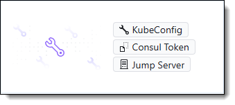

* Click on *Jump Server* to get the connection details
* Download the *Private Key* and save it to a dedicated folder
* In MobaXterm create a new SSH session using the Jump Server connection details <br><details><summary>Jump Server - MobaXterm mapping</summary>
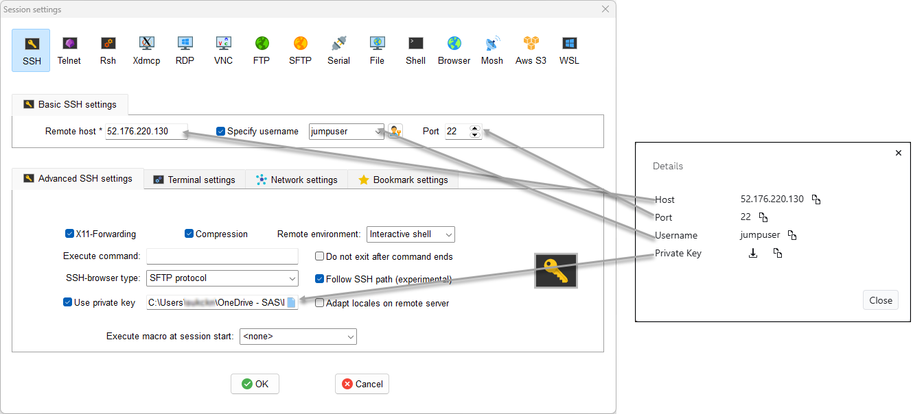
</details>

> :exclamation: **Note**: The Jump Server is very basic and does not have tools like *kubectl*, *helm* or *Viya CLI* installed. 

---

## ⚙️ Install kubectl
To get access to Kubernetes, we install *kubectl*. We can either install it on Windows and can also use it with other Kubernetes installations or we can install it on the Jump Server.

<details>
<summary>Install kubectl on Windows</summary>

* Download the *kubectl* binary:
    * Go to the [Kubernetes releases page](https://kubernetes.io/releases/download/).
    * Locate the latest stable release for Windows
    * Download the *kubectl.exe* file.

    <details>
    <summary>Download correct kubectl.exe</summary>

    If you are not sure which *kubectl.exe* to download (386, amd64, arm64), check your Windows architecture:

    * Press **Windows Key + R**, type *msinfo32*, and hit **Enter**.
    * Look for *System Type*:
        * If it says **x64-based PC**, you need **amd64**.
        * If it says **ARM-based PC**, you need **arm64**.
        * If it says **x86-based PC**, you need **386**.
    </details>  

* Add *kubectl* to your system's PATH:
    * Move the downloaded *kubectl.exe* to a directory on your system (e.g., C:\Program Files\Kubernetes\kubectl).
    * Search for "Edit the system environment variables" in Windows.
    * Click "Environment Variables".
    * Under "System variables" or "User variables", select the "Path" variable and click "Edit".
    * Add the directory where you placed *kubectl.exe* to the Path.
    * Close and reopen any command prompt or PowerShell windows for the changes to take effect.
* Connect to *Kubernetes on Engage Viya Server*
    * In your Windows home folder (C:\Users\\<**user**>) create subfolder *.kube* (e.g., C:\Users\sukabc\\.kube)
    * Copy *KubeConfig* file into subfolder *.kube*
    * Rename *KubeConfig* file to *config* (without any file suffix)
* Test *kubectl* connection
    * Open Windows PowerShell
    * Run command to show all namespaces in Kubernetes:<br>
        ```
        kubectl get ns
        ```
</details>  
<details>
<summary>Install kubectl on Jump Server</summary>

* Open *Jump Server* command line through *MobaXterm*
* Download the *kubectl* binary
    ```
    sudo curl -LO https://dl.k8s.io/release/$(curl -L -s https://dl.k8s.io/release/stable.txt)/bin/linux/amd64/kubectl
    ```
* Install *kubectl*
    ```
    sudo install -o root -g root -m 0755 kubectl /usr/local/bin/kubectl
    ```
* Test *kubectl*
    ```
    kubectl version
    ```
* Connect to *Kubernetes on Engage Viya Server*
    * Create *.kube* directory
        ```
        mkdir ~/.kube
        cd .kube/
        ```
    * Copy *KubeConfig* file into directory *.kube*
    * Rename *KubeConfig* file to *config*
        ```
        mv <kubeConfig>.txt config
        ```
* Test *kubectl* connection
    * Run command:
        ```
        kubectl get ns
        ```
</details>

---

## 🧙‍♂️ Install helm
To be able to install additional software via helm charts, we are going to install *helm*.
<details>
<summary>Install helm on Windows</summary>

* Download the *helm* binary:
    * Go to the [Helm releases](https://github.com/helm/helm/releases) page on GitHub.
    * Download the latest Windows executable file, which ends with .zip (e.g., helm-vX.Y.Z-windows-amd64.zip).
* Add *helm* to your system's PATH:
    * Extract the contents of the downloaded ZIP file to a convenient location, such as C:\Program Files\helm.
    * Search for "Edit the system environment variables" in Windows.
    * Click "Environment Variables".
    * Under "System variables" or "User variables", select the "Path" variable and click "Edit".
    * Add the directory where you placed *helm.exe* to the Path.
    * Close and reopen any command prompt or PowerShell windows for the changes to take effect.
* Verify *helm* installation
    * Open Windows PowerShell
    * Run command:
        ```
        helm version
        ```
</details>
<details>
<summary>Install helm on Jump Server</summary>

* Open *Jump Server* command line through *MobaXterm*
* To install helm 
    * Run command:
        ```
        cd ~
        sudo snap install helm --classic
        ```
* Verify *helm* installation
    * Run command:
        ```
        helm version
        ```

</details>

---

## 💻 Install Viya Command Line Interface
The *Viya CLI* is needed to create the Viya publishing destination for SCR. Once installed it can be used for other operation as well.

 ### Install Viya CLI
<details>
<summary>Install Viya CLI on Windows</summary>

* Download the *SAS Viya CLI* binary:
    * Go to the *SAS Viya CLI* [download](https://support.sas.com/downloads/package.htm?pid=2512).
    * Download the sas-viya for Windows zip file.
* Add *SAS Viya CLI* to your system's PATH:
    * Extract the contents of the downloaded ZIP file to a convenient location, such as C:\Program Files\viya-cli.
    * Search for "Edit the system environment variables" in Windows.
    * Click "Environment Variables".
    * Under "System variables" or "User variables", select the "Path" variable and click "Edit".
    * Add the directory where you placed *sas-viya.exe* to the Path.
    * Close and reopen any command prompt or PowerShell windows for the changes to take effect.
* Install plugins
    * Open Windows PowerShell
    * Run command (we only need one plugin):
        ```
        sas-viya plugins install --repo models
        ```
    * (optional) To install all *Viya CLI* plugins run:
        ```
        sas-viya plugins install --repo sas all
        ```
* Verify *SAS Viya CLI* installation
    * Open Windows PowerShell
    * Run command:
        ```
        sas-viya models
        ```
</details>

<details>
<summary>Install Viya CLI on Jump Server</summary>

* Download the *SAS Viya CLI* binary:
    * Go to the *SAS Viya CLI* [download](https://support.sas.com/downloads/package.htm?pid=2512).
    * Download the sas-viya for Linux zip file.
* Install *Viya CLI*
    * Open *Jump Server* command line through *MobaXterm*
    * Copy downloaded zip file to your Server home directory
    * To install the CLI run the below commands:

        ```
        cd ~
        tar xvzf ~/sas-viya-cli-*-linux-amd64.tgz
        rm -f ~/sas-viya-cli-*-linux-amd64.tgz
        sudo mv sas-viya /usr/local/bin

        sas-viya plugins list-repos
        sas-viya plugins list-repo-plugins

        sas-viya plugins install --repo sas all
        ```
* Verify *Viya CLI* installation
    * Run command:
        ```
        sas-viya -v
        ```
</details>

### Set up *Default Profile*
To use *Viya CLI* we at least need one CLI profile. We are going to set up a *default* profile. To setup other profiles see [documentaion](https://go.documentation.sas.com/doc/en/sasadmincdc/default/calcli/n0nr79o3hazpnpn1f1h676t4nbc7.htm#p0muj8ofe2l8efn189ree4gr4dg8).

* Run the command:
    ```
    sas-viya profile init
    ```
    * **Service Endpoint**: Go to your server details on [Engage Viya](https://catalog.engage.sas.com) and copy external URL.
        <details>
        <summary>External URL</summary>

        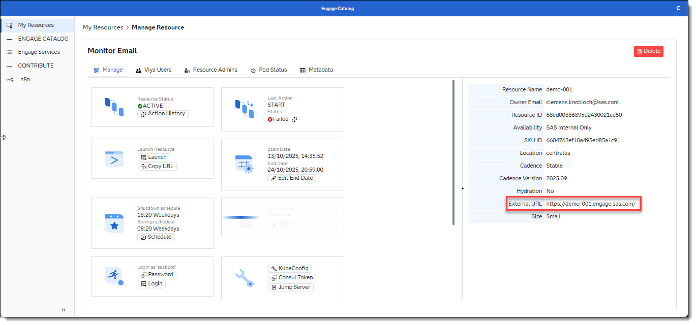
        </details>

    * **Output type**: Select an option.
    * **Enable ANSI colored output (y/n)**: Select an option.


> :exclamation: **Note**: To use the Viya CLI with Engage Viya use the login credentials for user `sasboot`.
* Login to Viya CLI<br>
    ```
    sas-viya auth login
    ```
    <details>
    <summary>sasboot credentials</summary>

    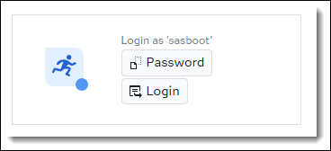
    </details>

---

## 🐘 Install Postgres
> :exclamation: **Note**: We can install a Postgres instance into Kubernetes. This is cheaper than using *Azure Database for PostgreSQL - Flexible Server* option when creating the Engage Viya server.

> :exclamation: **Note**: The default data storage for this Postgres instance is **200MB**!

### Install Postgres into Kubernetes

Open the command line for the environment where you have installed helm (*Windows PowerShell*, *MobaXterm*) and run the below commands:<br>
> :exclamation: **Note**: We install Postgres into the **default** namespace

#### Add helm chart:
```
helm repo add bitnami https://charts.bitnami.com/bitnami
```
```
helm repo update
```
#### Install Postgres: 
* **namespace:** default 
* **port:** 5431
* **database:** postgres
* **admin user:** sas
* **admin password:** lnxsas

Run command on Windows or Linux respectively:

<details>
<summary>Windows</summary>

```
helm install pg-demo bitnami/postgresql `
  --namespace default `
  --set auth.username=sas `
  --set auth.password=lnxsas `
  --set auth.database=postgres `
  --set primary.service.ports.postgresql=5431 `
  --set primary.containerPorts.postgresql=5431
```
</details>
<details>
<summary>Jump Server</summary>

```
helm install pg-demo bitnami/postgresql \
  --namespace default \
  --set auth.username=sas \
  --set auth.password=lnxsas \
  --set auth.database=postgres \
  --set primary.service.ports.postgresql=5431 \
  --set primary.containerPorts.postgresql=5431
```
</details>


> :bulb: **Tip**: To get the admin password for generic user "postgres" run below commands in the environment where you have installed kubectl:
>
<details>
<summary>Windows</summary>

```
$POSTGRES_ADMIN_PASSWORD = [Text.Encoding]::UTF8.GetString(
    [Convert]::FromBase64String(
        (kubectl get secret -n default pg-demo-postgresql -o jsonpath='{.data.postgres-password}')
    )
)
$POSTGRES_ADMIN_PASSWORD
```
</details>
<details>
<summary>Jump Server</summary>

```
export POSTGRES_ADMIN_PASSWORD=$(kubectl get secret -n default pg-demo-postgresql -o jsonpath="{.data.postgres-password}" | base64 -d)
echo $POSTGRES_ADMIN_PASSWORD
```
</details>

### Create database connection to Postgres in Viya 
Follow the below steps to create the Postgres connection in Viya:
* Go to Viya Manage Data - Tab: Sources
* Add - New connection
* Select PostgreSQL 
* Use the following settings:
    * Save Connection
        * **Connection name**: ```pg_demo```
        * **Short name**: ```pgdemo```
        * **Set the connection scope**: 
            * Global (Shared)
            * Add as connected library on startup
    - Connection
        * **Server**: ```pg-demo-postgresql.default.svc.cluster.local```
        * **Port number**: ```5431```
        * **Database**: ```postgres```
        * **Schema name**: ```public```
    * Authentication
        * User password
            * **User name**: ```sas```
            * **Password**: ```lnxsas```
* Click *Test connection* to ensure it can connect
* Click on *Save and connect*
<details>
<summary>Connection Details PostgreSQL</summary>

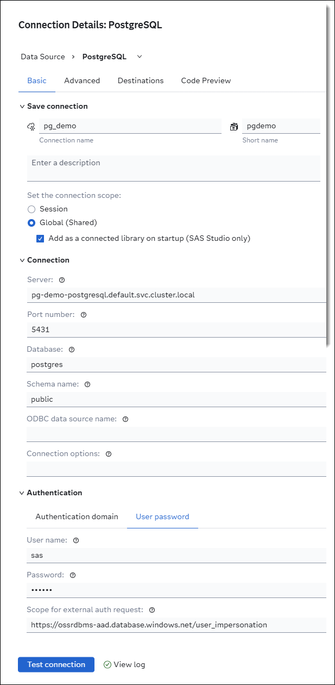
</details>

### Create Postgres connection from MAS
To setup a database connection in MAS follow the below steps:
* Go to Viya Environment Manager
* Go to Configuration
* Select Micro Analytic Score service
* Go to sas.microanalyticservice.properties
* Click on Edit (Pencil)
* Go to section: *connectionstring*
* Set the connection string for Postgres:

    * driver=sql;conopts=((driver=postgres;catalog=public;uid=<user>;pwd=',password>';server=<postgres ip address>;port=<port>;DB=<database name>;))
    * For the just installed Postgres database the connection string looks like:

        ```
        driver=sql;conopts=((driver=postgres;catalog=public;uid=sas;pwd='lnxsas';server= pg-demo-postgresql.default.svc.cluster.local;port=5431;DB=postgres;))
        ```
* Save the setting
* Re-start MAS to connect to Postgres. Run the below commands from the commandline where you have installed *kubectl*:

    <details>
    <summary>Windows</summary>

    ```        
    # Get MAS pod name and namespace
    $output = kubectl get pods --all-namespaces --no-headers -o custom-columns="NAMESPACE:.metadata.namespace,NAME:.metadata.name" |
        Select-String 'sas-microanalytic-score' |
        Select-Object -First 1

    # Extract namespace and pod name
    $parts = $output -split '\s+'
    $namespace = $parts[0]
    $podname = $parts[1]

    # Use them to restart MAS
    kubectl delete pod $podname -n $namespace
    ```
    </details>

    <details>
    <summary>Jump Server</summary>

    ```
    # Get MAS pod name and namespace
    output=$(kubectl get pods --all-namespaces --no-headers -o custom-columns="NAMESPACE:.metadata.namespace,NAME:.metadata.name" | grep '^.*sas-microanalytic-score' | head -n 1)

    # Extract namespace and pod name
    namespace=$(echo "$output" | awk '{print $1}')
    podname=$(echo "$output" | awk '{print $2}')

    # Use them to restart MAS
    kubectl delete pod "$podname" -n "$namespace"

    ```
    </details>

* Alternatively re-start the MAS pod via Lens.

---

## 📕 Install Redis
Add Redis Server to Kubernetes and configure Viya to use *Advanced Lists* in Intelligent Decisioning.

### Redis configuration
* Kubernetes namespace: *redis*
* Pod name: *sas-id-redis-master-*\<podsuffix\>
* Redis URI: *sas-id-redis-master.redis.svc.cluster.local*
* Redis port: *6379*
* Redis database: *0*
* Redis credentials:
    * Username: *default*
    * Password: *Orion123*

Open the command line for the environment where you have installed helm (*Windows PowerShell*, *MobaXterm*) and run the below commands:<br>

### Installation
* Create Kubernetes namespace for *redis*
    ```
    kubectl create namespace redis 
    ```

* Create Redis Secret in Kubernetes
    <details>
    <summary>Windows</summary>

    ```        
    kubectl create secret generic redis-auth `
    --from-literal=REDIS_PASSWORD='Orion123' `
    -n redis
    ```
    </details>


    <details>
    <summary>Jump Server</summary>
        
    ```
    kubectl create secret generic redis-auth \
    --from-literal=REDIS_PASSWORD='Orion123' \
    -n redis
    ```        
    </details>

* Prepare Helm Chart for Redis
    ```
    helm repo add bitnami https://charts.bitnami.com/bitnami
    helm repo update
    ```

* Install Redis into namespace *redis*
    <details>
    <summary>Windows</summary>

    ```
    helm install sas-id-redis bitnami/redis `
    --namespace redis `
    --set fullnameOverride=sas-id-redis `
    --set architecture=standalone `
    --set auth.enabled=true `
    --set auth.existingSecret=redis-auth `
    --set auth.existingSecretPasswordKey=REDIS_PASSWORD `
    --set service.port=6379 `
    --set replica.containerPorts.redis=6379
    ```
    </details>

    <details>
    <summary>Jump Server</summary>

    ```
    helm install sas-id-redis bitnami/redis \
    --namespace redis \
    --set fullnameOverride=sas-id-redis \
    --set architecture=standalone \
    --set auth.enabled=true \
    --set auth.existingSecret=redis-auth \
    --set auth.existingSecretPasswordKey=REDIS_PASSWORD \
    --set service.port=6379 \
    --set replica.containerPorts.redis=6379
    ```
    </details>

    > :exclamation: **Note**: If you see *"WARNING: Rolling tag detected..."* this can be ignored here as we install for testing only. In a production environment you want to make sure to install a specified version of redis.


    > :bulb: **Tip**: To check that *Redis* is working run the code below. The '*ping*' should be answered by a '*pong*'.<br>
    ```
    kubectl run --namespace redis redis-client --rm -it --image=redis:7.2-alpine --restart=Never -- sh
    redis-cli -h sas-id-redis-master -a "Orion123" ping
    exit
    ```

For additional information see [helm redis-stack GitHub](https://redis-stack.github.io/helm-redis-stack)

---

## 📦 Create Azure Container Registry
To publish decision flows to SCR we need a container registry. We are going to create an Azure container registry using the subscription for the Engage Viya server.
* Go to the [Engage Viya Catalog ](https://catalog.engage.sas.com/resources) and click on **Details** for the created server.
* Click on *Subscription*

    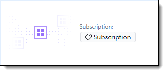<br>
    <details>
    <summary>This will open the Azure subscription for the Engage Viya server</summary>

    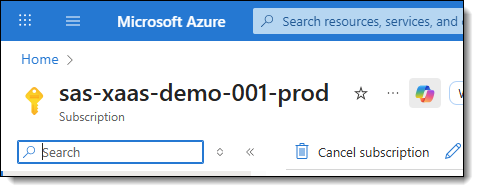
    </details>
* Go to *Resource groups*
* Create new *Resource groups*
    * Ensure you use the correct subscription (if there is more than one available)
    * Set *Resource group name* (e.g., container_rg)
    * Change *Region* if required
    * Click button *Review + create*
        <details>
        <summary>Create Resource groups dialog</summary>

        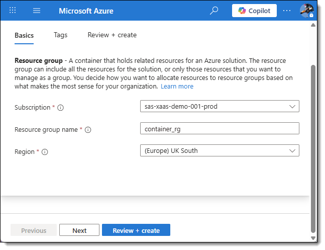
        </details>
    * Click button *Create*
* Go to *Container registries*
* Create new *Container registry*
    * Ensure you use the correct subscription (if there is more than one available)
    * Set the name for the just created *Resource group*
    * Set the *Registry name* (e.g., sasscr001)
        * If the name you choose is in use already, choose a different name.
    * Change *Location* if required
    * Click button *Review + create*
        <details>
        <summary>Create Resource groups dialog</summary>

        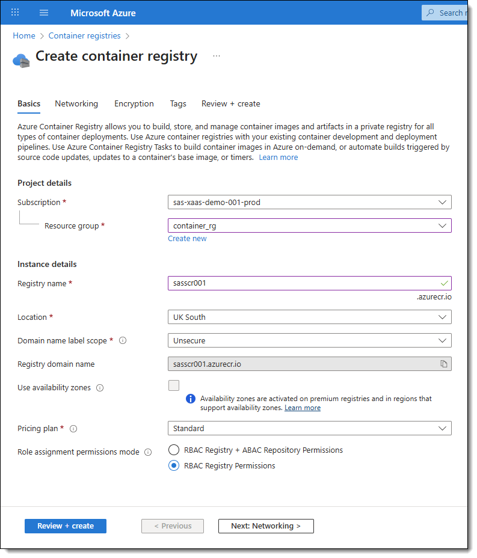
        </details>
    * Click button *Create*

---

## 🔑 Create Azure Open AI Key
To use an LLM with an Engage server we can create an Azure Open AI Key that goes together with the Engage subscription.
* Go to the [Engage Viya Catalog ](https://catalog.engage.sas.com/resources) and click on **Details** for the created server.
* Click on *Subscription*

    <br>
    <details>
    <summary>This will open the Azure subscription for the Engage Viya server</summary>

    
    </details>
* Go to *Go to Azure Open AI*
* Make sure the correct *Filter* is selected for the *Subscription*
    <details>
    <summary>Subscription filter</summary>

    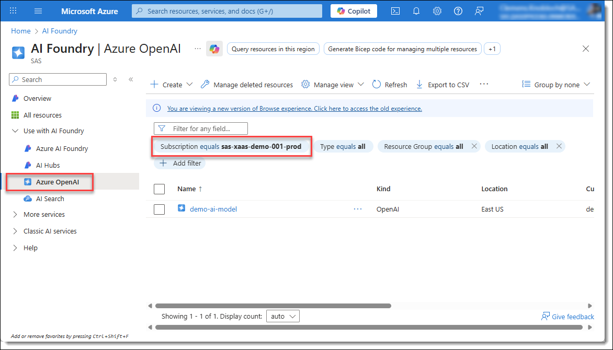
    </details>
* Click on *Create*
    * Select Azure Open AI
* In the upcoming dialog:
    * Ensure you use the correct *subscription* (if there is more than one available)
    * Select *Resource group name*
        * Select an existing Resource group or create a new one
    * Change *Region* if required
    * Set *Name*: (e.g., demo-ai-models)
        * If the name you choose is in use already, choose a different name.
    * Set *Pricing*: Standard SO
    <details>
    <summary>Create Azure Open AI</summary>

    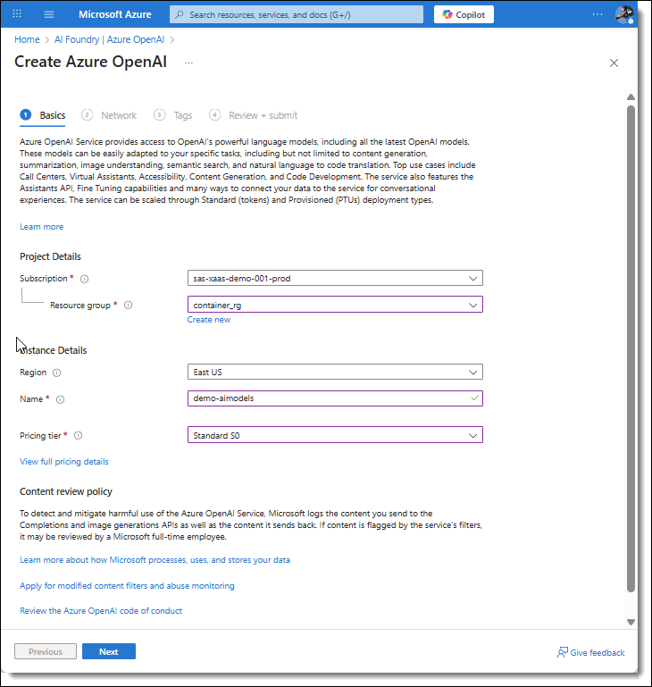
    </details>

* Click *Next*
    * Chose *All networks* (as we are in development mode)
* Click *Next*
* Click *Next*
* Click *Create*
* Click *Go to resource*
* Click *Explore Azure AI Foundry Portal*
* When the *Azure AI Foundry* diagog is open make sure the correct resource is selected        
    <details>
    <summary>Azure Open AI resource</summary>

    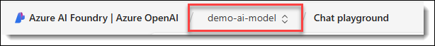
    </details>
 
* In left side menu: Click *Shared resources / Deployments*
* Click on Deploy model
    * Deploy base model
* In the upcoming dialog:
    * Select *model: gpt-4o-mini
    * Click *Confirm*
* In the next dialog:
    * Leave *Deployment name* as gpt-4o-mini
* Select *Deployment type*: Standard
* Click *Deploy*
* In model deployment UI 
    * Look for: **Get Started**, **1. Authentication using API Key**
    * From the code snippet copy and save the value for variable *api_version*
        <details>
        <summary>Lookup api_version</summary>

        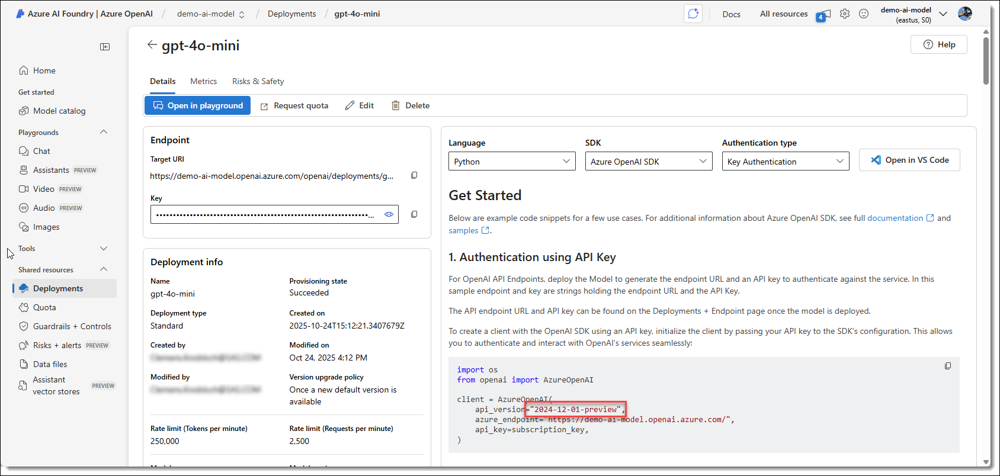
        </details>
* In left side menu: Click *Home*
    * Copy and save API Key 1
    * Copy and save Azure OpenAI endpoint
        <details>
        <summary>Azure Open AI AIP Key and endpoint</summary>

        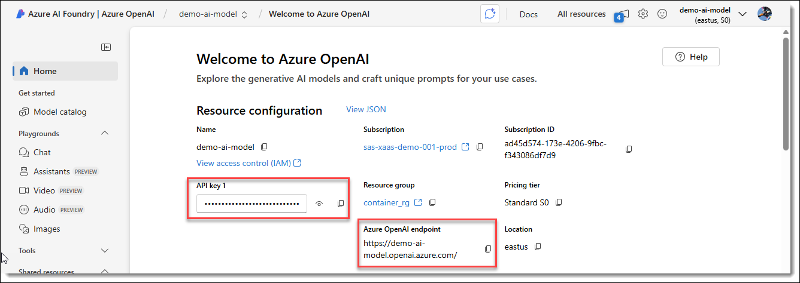
        </details>

> :exclamation: **Note:** *API Key 1*, *Azure OpenAI endpoint* and *api_version* is required when calling an Azure LLM in a decision flow.

---

## 🚀 Setup publishing destination for SCR
To publish decision flows to a container registry a *Private Docker* publishing destination is required. Below are instruction for setting up publishing destinations for using a database (PostgreSQL) and not using a database. Depending on the decision flow, if it is using a database or not you need to use the appropriate publishing destination.<br> 
E.g., If a decision flow does not use a database we use the publishing destination without a database wich will create a smaller container image and untilately smaller container.

> ℹ️ **Info**:  For more information see [SAS Viya Documenation](https://go.documentation.sas.com/doc/en/sasadmincdc/v_069/calpubdest/p02scrqf37kexwn1gi60khpshifz.htm#p1f2d2x0t2a3vvn1j88t6ix1f6gm)

* Set the variable values in the below sas-viya command script to meet your requirement:

    <details>
    <summary>Windows without database</summary>

    ```
    ####################################################### 
    #Set variables for Publishing Destination
    ####################################################### 
    $PublishingDestination= "<Publishing Destination Name>"
    $RegistryLoginServer= "<Container Registry: Login server>"
    $RegistryUsername= "<Container Registry: Username>"
    $RegistryPassword= "<Container Registry: password>"
    $ExternalViyaURL= "<Engage Viya External URL>"

    ########################################################
    $kubeURL= "$ExternalViyaURL`:6443"
    $credDomainID= "publishDomain-$PublishingDestination"

    # Create ID publishing destination
    sas-viya models destination createPD `
    --name $PublishingDestination `
    --baseRepoURL $RegistryLoginServer `
    --registryId $RegistryUsername `
    --registryPassword $RegistryPassword `
    --kubeURL $kubeURL `
    --kubeCert "na" `
    --kubekey "na" `
    --pipConfig pip-config `
    --validationNamespace default `
    --identityId "SASAdministrators" `
    --identityType "group" `
    --credDescription "Credentials domain for Container Registry" `
    --credDomainID $credDomainID
    ```
    </details>

    <details>
    <summary>Windows with database</summary>

    ```
    ####################################################### 
    #Set variables for Publishing Destination
    ####################################################### 
    $PublishingDestination= "<Publishing Destination Name>"
    $RegistryLoginServer= "<Container Registry: Login server>"
    $RegistryUsername= "<Container Registry: Username>"
    $RegistryPassword= "<Container Registry: password>"
    $ExternalViyaURL= "<Engage Viya External URL>"

    ########################################################
    $kubeURL= "$ExternalViyaURL`:6443"
    $credDomainID= "publishDomain-$PublishingDestination"

    # Create ID publishing destination
    sas-viya models destination createPD `
    --name $PublishingDestination `
    --baseRepoURL $RegistryLoginServer `
    --registryId $RegistryUsername `
    --registryPassword $RegistryPassword `
    --kubeURL $kubeURL `
    --kubeCert "na" `
    --kubekey "na" `
    --pipConfig pip-config `
    --databaseDriver postgresql `
    --validationNamespace default `
    --identityId "SASAdministrators" `
    --identityType "group" `
    --credDescription "Credentials domain for Container Registry" `
    --credDomainID $credDomainID
    ```
    </details>

    <details>
    <summary>Jump Server without database</summary>

    ```
    #########################################################
    # Set variables for Publishing Destination
    #########################################################
    PublishingDestination="<Publishing Destination Name>"
    RegistryLoginServer="<Container Registry: Login server>"
    RegistryUsername="<Container Registry: Username>"
    RegistryPassword="<Container Registry: password>"
    ExternalViyaURL="<Engage Viya External URL>"

    #########################################################
    kubeURL="${ExternalViyaURL}:6443"
    credDomainID="publishDomain-${PublishingDestination}"

    # Create ID publishing destination
    sas-viya models destination createPD \
    --name "$PublishingDestination" \
    --baseRepoURL "$RegistryLoginServer" \
    --registryId "$RegistryUsername" \
    --registryPassword "$RegistryPassword" \
    --kubeURL "$kubeURL" \
    --kubeCert "na" \
    --kubekey "na" \
    --pipConfig pip-config \
    --validationNamespace default \
    --identityId "SASAdministrators" \
    --identityType "group" \
    --credDescription "Credentials domain for Container Registry" \
    --credDomainID "$credDomainID"
    ```
    </details>

    <details>
    <summary>Jump Server with database</summary>

    ```
    #########################################################
    # Set variables for Publishing Destination
    #########################################################
    PublishingDestination="<Publishing Destination Name>"
    RegistryLoginServer="<Container Registry: Login server>"
    RegistryUsername="<Container Registry: Username>"
    RegistryPassword="<Container Registry: password>"
    ExternalViyaURL="<Engage Viya External URL>"

    #########################################################
    kubeURL="${ExternalViyaURL}:6443"
    credDomainID="publishDomain-${PublishingDestination}"

    # Create ID publishing destination
    sas-viya models destination createPD \
    --name "$PublishingDestination" \
    --baseRepoURL "$RegistryLoginServer" \
    --registryId "$RegistryUsername" \
    --registryPassword "$RegistryPassword" \
    --kubeURL "$kubeURL" \
    --kubeCert "na" \
    --kubekey "na" \
    --pipConfig pip-config \
    --databaseDriver postgresql \
    --validationNamespace default \
    --identityId "SASAdministrators" \
    --identityType "group" \
    --credDescription "Credentials domain for Container Registry" \
    --credDomainID "$credDomainID"
    ```
    </details>

* **PublishingDestination**: Set a name for the publishing destination (without database e.g., AzureDocker, with database e.g., AzureDocker-PG)
* **RegistryLoginServer**: Set *Login server* name for the container registry
    * See [Get values from Azure Container registry](#get-values-from-azure-container-registry) to get the *Login server* name
* **RegistryUsername**: Set *Username* for the container registry
    * See [Get values from Azure Container registry](#get-values-from-azure-container-registry) to get the *Username*
* **RegistryPassword**: Set *password* for the container registry
    * See [Get values from Azure Container registry](#get-values-from-azure-container-registry) to get the *password*
* **ExternalViyaURL**: Set *Engage Viya External URL* for the container registry together with port 6443
    * Go to the [Engage Viya Catalog ](https://catalog.engage.sas.com/resources) and click on **Details** for your server.
        <details>
        <summary>Get External URL</summary>

        
        </details>
* When you have set the variable values, go to your Viya CLI prompt
    * Login to sas-viya cli. Run the command and follow the instructions.
        ```
        sas-viya auth loginCode
        ```
    * Run the modified script to create the publishing destination.

### Get values from Azure Container registry
<details>
<summary>Azure Container registry</summary>

* Go to the [Engage Viya Catalog ](https://catalog.engage.sas.com/resources) and click on **Details** for your server.
* Click on *Subscription*

    <br>
    <details>
    <summary>This will open the Azure subscription for the Engage Viya server</summary>

    
    </details>
* Got to *Container registry*
* Select your *Container registry*
* For your *Container registry* select *Access keys*
* At *Container registry* - *Access keys* you get all registry information you need for the publishing destination
    <details>
    <summary>Container registry - Access keys</summary>

    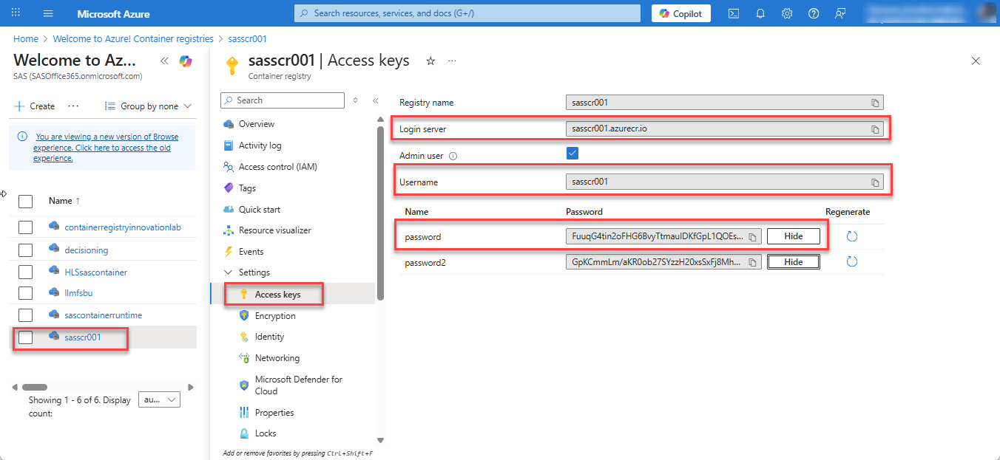
    </details>

</details>

---

## 📋 Configure Viya for Advanced Lists
To use *Advanced Lists* in Intelligent Decisioning we have to configure *Viya* to use *Redis* accordingly.

### Configure List Data Service
Create a *List Data Service* pointing to the Viya folder where we save the *Advanced Lists*. We are setting up the service to point to the default Advanced List folder: */Products/List Data*

* Run the below command to get the folder id for the default Advanced List folder:
    ```
    sas-viya folders list --name "List Data" | awk 'NR==2 {print $1}'
    ```

* Open *Viya Environment Manager*
* Go to *Configuration*
* Select *Definitions*
* Filter on *redis*
* Select *sas.commons.redis.servers*
* Create *New Configuration*
* Set parameters
    * **Services**: *List Data service* - Click on *pencil* and select value List Data service.
    * **Name**: *redisdata* - Set name for Redis configuration properties. Define each Redis instance with a unique, lowercase name e.g., redisdata
    * **Host**: *sas-id-redis-master.redis.svc.cluster.local* - The k8s internal Redis IP address
    * **Logical Database**: *0* - Set the number of the Redis database
    * **Port**: *6379* - Set the Redis port number
    * Click on *Add property* 
        * **Name**: *folders* - the value for name needs to be 'folders' to point to the Advanced List folders.
        * **Value**: *\<folder id\>  - Cody the folder_id here that we have read in the first step.
        <details>
        <summary>sas.commons.redis.servers</summary>

        
        </details>

    * Click *Save*

> For more information see [Using Redis for List Data](https://go.documentation.sas.com/doc/en/sasadmincdc/default/calconfig/n0yoibr26a822en1j3jmqz71ni6g.htm#n0x6h10574g221n114pam9go6f50)

### Create custom user group for Redis
To create a custom user group run the below command:
```
sas-viya identities create-group --id redisusr --name "Redis Users"
```

#### Add members to the group
* In Environment Manager go to *Users and Groups*
* Select *Custom groups*
* Select *Redis Users*
* Add members to the group
    * Add members who can access redis (through advanced lists)
    <details>
    <summary>Redis user group</summary>

    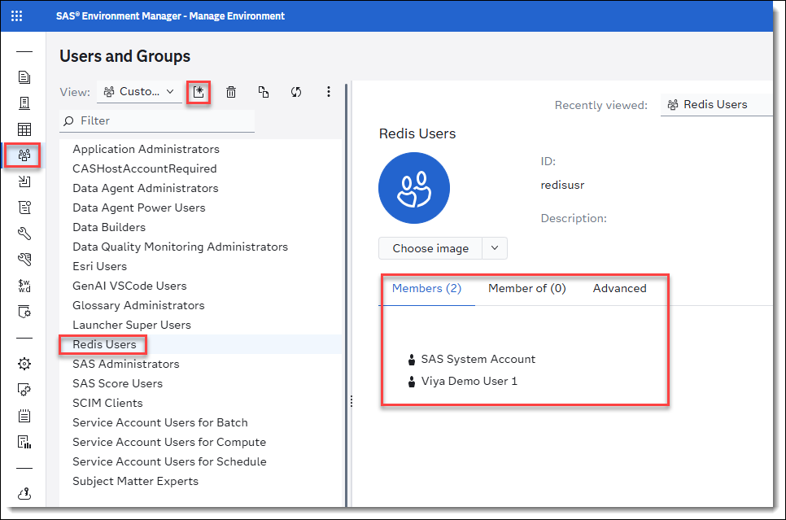
    </details>

### Add Credentials to ListDataRedis domain
By configuring *List Data Service*, Viya has created a *ListDataRedis* domain. We need to add credentials to the domain.<br>
<details>
<summary>ListDataRedis domain</summary>


</details>

#### Add credentials using Environment Manager
* In Environment Manager go to Domains
* Highlight *ListDataRedis*
* Add Credentials (right mouse click menu)
* In the new dialog click on button *New*
* Set Parameters
    * **Identities**: Select newly created *Redis Users* group
    * **User ID**: Set to *default*. This is the default user name in Redis
    * **Password**: Set to Redis password: *Orion123*

#### Add credentials using SAS-Viya CLI
* Alternatively execute the below SAS-Viya CLI command:
    ```
    sas-viya credentials groups create --identity-id redisusr --domain-id ListDataRedis --user default --password Orion123
    ```
<details>
<summary>ListDataRedis domain Credentials</summary>


</details>

### Set Client Credentials for MAS
We also need to set client credentials for MAS to connect to Redis. From the SAS-Viya CLI run the below cammand:
```
sas-viya credentials clients create --domain-id ListDataRedis --identity-id sas.microanalyticScore --user default --password Orion123
```
> :exclamation: **Note**: After you have executed the above command the domain **ListDataRedis** will no longer be visible in the Viya Domain UI.
<details>
<summary>Viya Domains</summary>


</details>

See also [Viya-CLI](https://go.documentation.sas.com/doc/en/sasadmincdc/default/calcredentials/p0c0l75i14ni65n10515di5layj8.htm) for maintaining credentials.

> :exclamation: **Note**: At this point you can create Advanced Lists in Intelligent Decisioning. To test the Advanced Lists in Intelligent Decisioning you also need to set the CAS environment variables.

### Set CAS Environment Variables (via Environment Manager)
When we set environment variables via Environment Manager we set the variables per compute context.

* In Environment Manager go to Context
* Select View: *Compute contexts*
* Click on *SAS Intelligent Decisioning compute context* 
    * This is the context used by Intelligent Decisioning when runing tests
    <details>
    <summary>SAS Intelligent Decisioning compute context</summary>

    
    </details>

* Select the *edit icon* (Pencil icon) in the upper right corner of the right pane
* Select the *Advanced tab*, and set the value of the environment variable in the text box for SAS options.
    * Use the -SET option before the value specification
        ```
        -set SAS_REDIS_RESOURCE_CFG sid-lists
        -set SAS_REDIS_HOST sas-id-redis-master.redis.svc.cluster.local
        -set SAS_REDIS_PORT '6379'
        -set SAS_REDIS_AUTH_PASS Orion123
        ```
        <details>
        <summary>Set Environment Variables</summary>

        
        </details>

* Click *Save*

> :exclamation: **Note**: If you want to use redis in SAS Studio, you have to set the environment variables for the appropriate Studio context too.

### Set MAS Environment Variable (via Lens)
For MAS to run Decision Flows that use *Advanced Lists* we have to set MAS environment variables

* Open Lens for Viya installation
* Go to Deployments
* Search *sas-microanalytic-score* and click on *Edit*
* Go to section *spec*<br>
    <details>
    <summary>section spec</summary>

    
    </details>
* In section *spec* look for container *sas-microanalytic-score*
    <details>
    <summary>container sas-microanalytic-score</summary>

    
    </details>
* Under container *sas-microanalytic-score* look for section *env*
    <details>
    <summary>section env</summary>

    
    </details>
* At the end of section *env* at environment variables:
    ```
    - name: SAS_REDIS_RESOURCE_CFG
      value: sid-lists
    - name: SAS_REDIS_HOST
      value: sas-id-redis-master.redis.svc.cluster.local
    - name: SAS_REDIS_PORT
      value: '6379'
    - name: SAS_REDIS_AUTH_PASS
      value: Orion123
    ```
* Click on *Save and Close* button
    * This will automatically restart MAS.

---

## 🔍 Connect to Lens
To connect the server to Lens download the *KubeConfig* file and use the contents to add a new cluster to Lens. 


---

## 🐍 Add Python libraries
By default not all required Python libraries may be installed. To make Python calls to LLMs we can install the Python *openai* library.

* Go to Kubernetes in Lens
* Go to section ConfigMaps 
* Select config file that starts with *sas-pyconfig-parameters* (in the *Viya* namespace)
* Open file and look for section *default_py.pip_install_packages*
* Add library names to the end of the list (space separated):
    * openai 
    * tiktoken
* Scroll to the end of the dialog and save the change<br>
    <details>
    <summary>Add Python library</summary>

    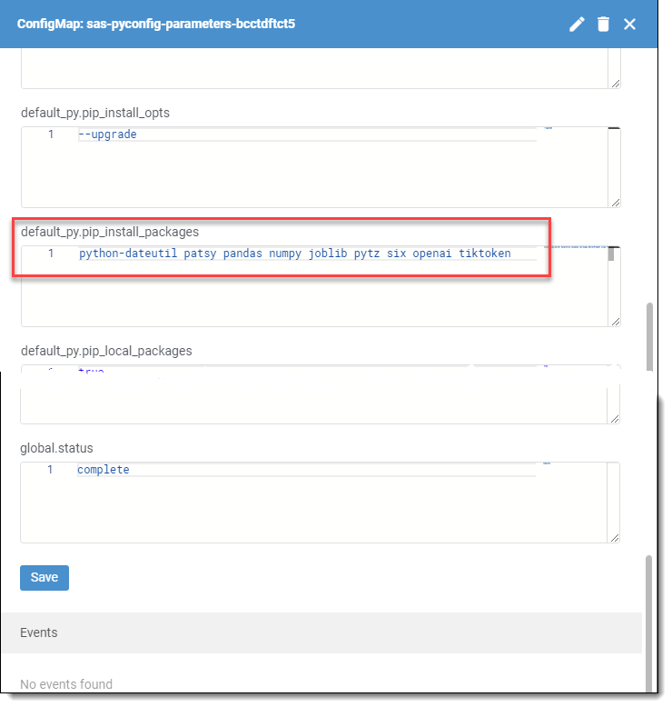
    </details>
* Go to section CronJobs
* Select *sas-pyconfig*
* Trigger CronJob
    <details>
    <summary>Trigger Job</summary>

    
    </details>

> :bulb: **Tip**: You can check the status of the running job by looking it up in the section Pods. Look for a job that starts calling *sas-pyconfig-manual* and check the log for *sas-pyconfig*.

* Validate added libraries
    * Go to Viya SAS Studio
    * Open *New Python script*
    * Run statement:
        ```
        import openai, tiktoken
        ```
> ℹ️ **Info**: See also [KB article](https://sas.service-now.com/kb/en-GB/installing-python-packaged-in-viya-engage-catalog-environment?id=kb_article_view&sysparm_article=KB0040276) for installing Python libraries via Jump server command line.

---

## 📥 Install k8s-scr-mgr
[k8s-scr-mgr](https://github.com/sukckn/k8s-scr-mgr/tree/main) is a tool for loading SAS Container Runtime (SCR) images into Kubernetes and manage the images.<br>

### Installation
* To install *k8s-scr-mgr* use its helm chart install command ```helm install k8s-scr-mgr oci://ghcr.io/sukckn/k8sscrmgr```.<br>
    The helm chart will install *k8s-scr-mgr* into namespace ```k8sscrmgr``` and create namespace ```scr``` as dedicated namespace for SCR.<br> 
    Replace the tokens in the command below before executing:<br>
    | helm parameter                            | token                      | comment |
    | ---                                       | ---                        | ---     |
    | namespace                                 |                            | The namespace where *k8s-scr-mrg* is going to be installed. |
    | k8sScrMgr.host                            | \<Engage_Viya_URL\>        | <details><summary>The external Engage Viya URL</summary></details> e.g. k8sScrMgr.host=viya.engage.com |
    | k8sScrMgr.kubeconfig                      |                            | Pointing to the kube config file. If your config file is not in the default location you need to change the setting.<br>Windows: "C:\\Users\\sukckn\\.kube\\config"<br>Jump Server: $HOME/.kube/config<br>See also [Install kubectl](#️-install-kubectl) |
    | scr[0].publishingDestination              | <Publishing_Destination>   | The name of the publishing destination that you have set under [Setup publishing destination](#-setup-publishing-destination-for-scr).
    | scr[0].dbCredentials                      |                            | Database connection string.<br>If you have installed the database like in [Install Postgres](#-install-postgres) you can use the connection string as using in the helm command below. Otherwise it needs to get adjusted. |
    | scr[0].dockerCredentials.baseRepoURL      | \<Container_Registry\>     | The container registry location (URI)<br><br>If you use an Azure container registry as explained under [Create Azure Container Registry](#-create-azure-container-registry), see [Get values from Azure Container registry](#get-values-from-azure-container-registry) for *Login server*<br><details><summary>Login server</summary></details> |
    | scr[0].dockerCredentials.registryId       | \<Container_Registry_ID\>  | The container registry user ID.<br>If you use an Azure container registry as explained under [Create Azure Container Registry](#-create-azure-container-registry), see [Get values from Azure Container registry](#get-values-from-azure-container-registry) for *Username*<br><details><summary>Username</summary></details>|
    | scr[0].dockerCredentials.registryPassword | \<Container_Registry_PSW\> | The container registry password<br>If you use an Azure container registry as explained under [Create Azure Container Registry](#-create-azure-container-registry), see [Get values from Azure Container registry](#get-values-from-azure-container-registry) for *password*<br><details><summary>password</summary></details>|
    
    <details>
    <summary>Windows</summary>

    ```
    helm install k8s-scr-mgr oci://ghcr.io/sukckn/k8sscrmgr `
    --namespace k8sscrmgr `
    --create-namespace `
    --set k8sScrMgr.host=<Engage_Viya_URL> `
    --set-file k8sScrMgr.kubeconfig="C:\\Users\\sukckn\\.kube\\config" `
    --set scr[0].publishingDestination=<Publishing_Destination> `
    --set-string scr[0].dbCredentials="driver=sql;conopts=((driver=postgres;catalog=public;uid=sas;pwd='lnxsas';server= pg-demo-postgresql.default.svc.cluster.local;port=5431;DB=postgres;))" `
    --set scr[0].dockerCredentials.baseRepoURL=<Container_Registry> `
    --set scr[0].dockerCredentials.registryId=<Container_Registry_ID> `
    --set-string scr[0].dockerCredentials.registryPassword=<Container_Registry_PSW>
    ```
    </details>

    <details>
    <summary>Jump Server</summary>

    ```
    helm install k8s-scr-mgr oci://ghcr.io/sukckn/k8sscrmgr \
    --namespace k8sscrmgr \
    --create-namespace \
    --set k8sScrMgr.host=viya-lh5s6xs7lp.engage.sas.com \
    --set-file k8sScrMgr.kubeconfig=$HOME/.kube/config \
    --set scr[0].publishingDestination=<Publishing_Destination> \
    --set-string scr[0].dbCredentials="driver=sql;conopts=((driver=postgres;catalog=public;uid=sas;pwd='lnxsas';server= pg-demo-postgresql.default.svc.cluster.local;port=5431;DB=postgres;))" \
    --set scr[0].dockerCredentials.baseRepoURL=decisioning.azurecr.io \
    --set scr[0].dockerCredentials.registryId=decisioning \
    --set-string scr[0].dockerCredentials.registryPassword=u4w3Z6bWrCr0NQMdL+NRoQbVCvdcBOcZZgURtIRKLq+ACRAbPpCz
    ```
    </details>

### K8S SCR Manager UI
The ID - K8S SCR Manager custom step allows you to interact with the *k8s-scr-mgr* service from within SAS Viya using SAS Studio.<br>
To install the custom step see [ID - K8S SCR Manager](https://github.com/sukckn/k8s-scr-mgr/tree/main?tab=readme-ov-file#id---k8s-scr-manager) in the *k8s-scr*-mrg documentation. 

<details>
<summary>K8S SCR Manager</summary>

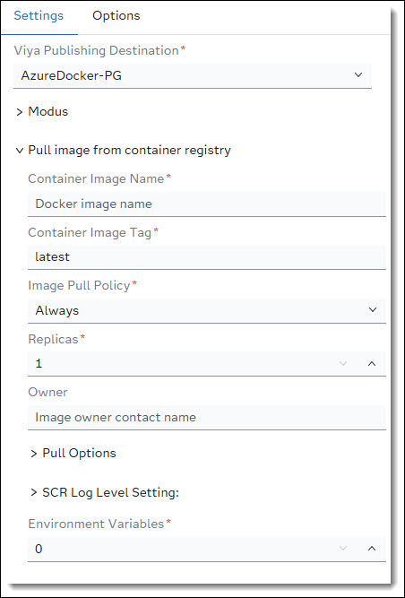
</details>

<br>

> ℹ️ **Info**: For more information see [K8S-SCR-Magager Documentation](https://github.com/sukckn/k8s-scr-mgr). 

---

## 🛡️ Adjust Firewall and Ingress settings
From the *Jump Server* we cannot make a REST call to the Viya server. For example we cannot call a SCR container REST API from *Jump Server*. For this we need to adjust the firewall settings in Azure and also the Ingress settings in Kubernetes.

### Adjust Firewall
* Open the Engage Server Subscription
* Go to Resource groups
* Look for a Resource group that starts with ```MC_``` and open it
* Look for the Resource where type is: *Network security group* and open it
* Left side menu: Click on Settings / Inbound security rules
* Click on Add to add a new rule
* Set parameters for new rule:

    | Parameter | Value |
    | ---       | ---   |
    | Source | IP Address |
    | Source IP addresses/CIDR ranges | set to *Engage Server IP Address* |
    | Destination port ranges | * |
    | Name | Allow-Jump-Server |

    <details>
    <summary>Allow Jump Server</summary>

    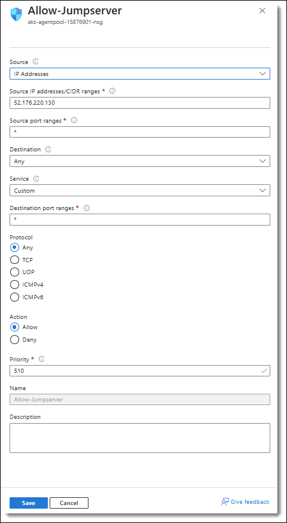
    </details>

### Adjust Ingress settings
* Open Lens for your *Engage Server*
* Go to *Services*
* Select namespace *ingress-nginx*
* Open *ingress-nginx-controller* in Edit mode
    * Click *3-dot menu* and select *Edit*
* In the file go to section: *loadBalancerSourceRanges*
    * This is the long list of IP addresses
* Add the *Engage Server IP Address* to the list with leading dash and CIDR 32
    * E.g: - 125.25.124.14/32
* *Save* the change

> :exclamation: Note: It can take a few minutes until the changed settings take effect.

---

## 🦘 Open port for on Jump server
If you run a webserver from the *jump server* you may have to open the appropriate port to make your service visible from outside. For this we need to adjust settings in Azure.
* Open the *Engage Server Subscription*
* Go to *Resource groups*
* Look for a Resource group that has is called like you Engage server plus suffix **-dev_rg** and open it
    <details>
    <summary>Jump Server Resource Groups</summary>

    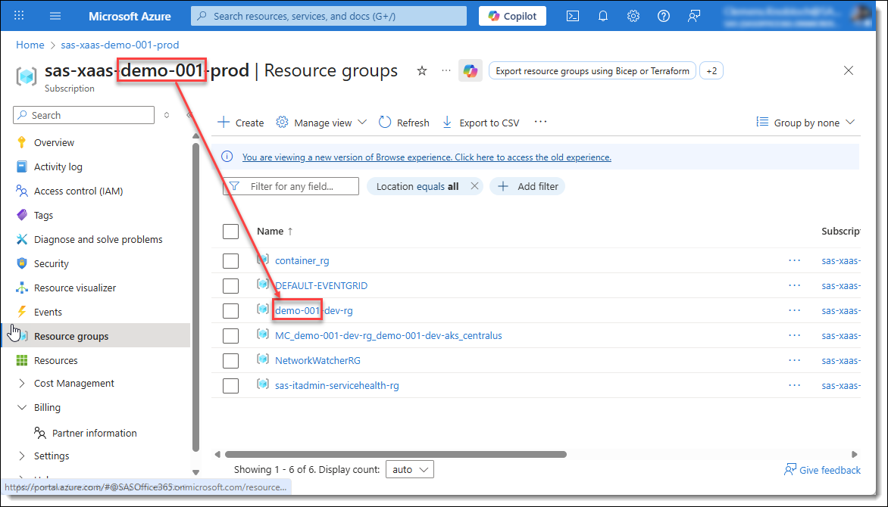
    </details>
* Look for the *Network security group* and open it
* Under *Inbound Security Rules* open rule named like the Engage Server
    * The rule should be open port 22 by default
* Change the prot setting
    * Change parameter *Service* to *Custom*
    * Under *Destination port ranges* add port you want to open (comma separated) or set an asterisk (*) to open all port.
        <details>
        <summary>Open Port on Jump Server</summary>

        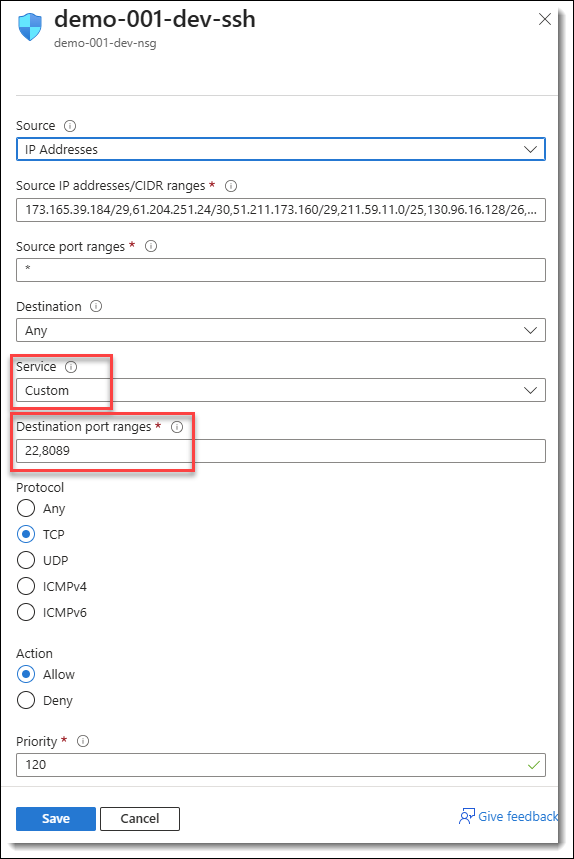
        </details>
    * *Save* changes
